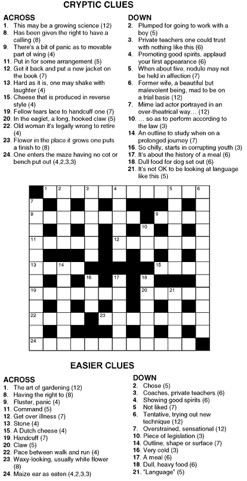

xwbinarier
==========

Extract a matrix of binary values (white and black shaded squares) from crossword image

Use brew to [Install OpenCV on Mac OS X Mavericks](https://jjyap.wordpress.com/2014/05/24/installing-opencv-2-4-9-on-mac-osx-with-python-support/). There is also explained how to link OpenCV and Python.

Code was taken from ["Crossword digitization using image processing" in StackOverflow](http://stackoverflow.com/questions/16975556/crossword-digitization-using-image-processing)

This is a sample image file:

Run program:

    python main.py
  
We will get this matrix:

    [[ 0.  1.  1.  1.  1.  1.  1.  1.  1.  1.  1.  1.  1.]
     [ 1.  0.  1.  0.  1.  0.  1.  0.  0.  0.  1.  0.  1.]
     [ 1.  1.  1.  1.  1.  1.  1.  1.  0.  1.  1.  1.  1.]
     [ 1.  0.  1.  0.  1.  0.  1.  0.  1.  0.  1.  0.  1.]
     [ 1.  1.  1.  1.  1.  0.  1.  1.  1.  1.  1.  1.  1.]
     [ 1.  0.  0.  0.  1.  0.  1.  0.  1.  0.  1.  0.  1.]
     [ 1.  1.  1.  1.  0.  0.  0.  0.  0.  1.  1.  1.  1.]
     [ 1.  0.  1.  0.  1.  0.  1.  0.  1.  0.  0.  0.  1.]
     [ 1.  1.  1.  1.  1.  1.  1.  0.  1.  1.  1.  1.  1.]
     [ 1.  0.  1.  0.  1.  0.  1.  0.  1.  0.  1.  0.  1.]
     [ 1.  1.  1.  1.  0.  1.  1.  1.  1.  1.  1.  1.  1.]
     [ 1.  0.  1.  0.  0.  0.  1.  0.  1.  0.  1.  0.  1.]
     [ 1.  1.  1.  1.  1.  1.  1.  1.  1.  1.  1.  1.  0.]]

- 0s for black shaded squares
- 1s for white squares

# 15x15 Crossword

Let's consider a different grid. [Crucigrama 6 taken from elcriptico.com](http://elcriptico.com/crucigrama-6/)

In code, we will need to change the task name

    taskName = 'crucigrama8'

Adjustment to rows and cols variables will be needed

    rows = 15
    cols = 15

After running python script, we will get a file (*-square-map.txt) containing the following array:

    1, 1, 1, 1, 1, 1, 1, 1, 1, 1, 0, 1, 1, 1, 1
    1, 0, 1, 0, 1, 0, 1, 0, 1, 0, 1, 0, 1, 0, 1
    1, 1, 1, 1, 1, 0, 1, 1, 1, 1, 1, 1, 1, 1, 1
    1, 0, 1, 0, 1, 0, 1, 0, 1, 0, 1, 0, 1, 0, 1
    1, 1, 1, 1, 1, 1, 0, 1, 1, 1, 1, 1, 1, 1, 1
    1, 0, 1, 0, 1, 0, 1, 0, 1, 0, 1, 0, 1, 0, 1
    0, 1, 1, 1, 1, 1, 1, 0, 0, 1, 1, 1, 0, 0, 1
    1, 0, 1, 0, 0, 0, 1, 0, 1, 0, 0, 0, 1, 0, 1
    1, 0, 0, 1, 1, 1, 0, 0, 1, 1, 1, 1, 1, 1, 0
    1, 0, 1, 0, 1, 0, 1, 0, 1, 0, 1, 0, 1, 0, 1
    1, 1, 1, 1, 1, 1, 1, 1, 0, 1, 1, 1, 1, 1, 1
    1, 0, 1, 0, 1, 0, 1, 0, 1, 0, 1, 0, 1, 0, 1
    1, 1, 1, 1, 1, 1, 1, 1, 1, 0, 1, 1, 1, 1, 1
    1, 0, 1, 0, 1, 0, 1, 0, 1, 0, 1, 0, 1, 0, 1
    1, 1, 1, 1, 0, 1, 1, 1, 1, 1, 1, 1, 1, 1, 1

What about squares with numbers (references to clues)?

We got them in a file named *-number-map.txt. File content is the following:

     1,  0,  2,  0,  3,  0,  4,  0,  5,  0,  0,  6,  7,  0,  8
     0,  0,  0,  0,  0,  0,  0,  0,  0,  0,  9,  0,  0,  0,  0
    10,  0,  0,  0,  0,  0, 11,  0,  0,  0,  0,  0,  0,  0,  0
     0,  0,  0,  0,  0,  0,  0,  0,  0,  0,  0,  0,  0,  0,  0
    12,  0,  0,  0,  0,  0,  0, 13,  0,  0,  0,  0,  0,  0,  0
     0,  0,  0,  0,  0,  0, 14,  0,  0,  0,  0,  0,  0,  0,  0
     0, 15,  0,  0,  0,  0,  0,  0,  0, 16,  0,  0,  0,  0,  0
    17,  0,  0,  0,  0,  0,  0,  0, 18,  0,  0,  0, 19,  0,  0
     0,  0,  0, 20, 21,  0,  0,  0, 22,  0, 23,  0,  0,  0,  0
     0,  0, 24,  0,  0,  0, 25,  0,  0,  0,  0,  0,  0,  0, 26
    27,  0,  0,  0,  0,  0,  0,  0,  0, 28,  0,  0,  0,  0,  0
     0,  0,  0,  0,  0,  0,  0,  0, 29,  0,  0,  0,  0,  0,  0
    30,  0,  0,  0,  0,  0,  0,  0,  0,  0, 31,  0,  0,  0,  0
     0,  0,  0,  0,  0,  0,  0,  0,  0,  0,  0,  0,  0,  0,  0
    32,  0,  0,  0,  0, 33,  0,  0,  0,  0,  0,  0,  0,  0,  0

We use both arrays as input for [xwHelper](https://github.com/HartasCuerdas/xwHelper), a HTML5+JS crossword helper.
